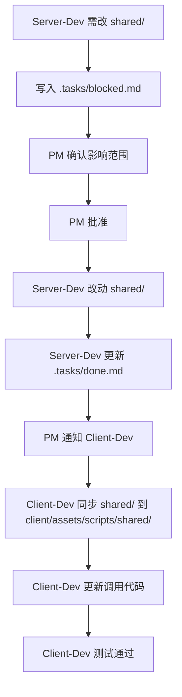
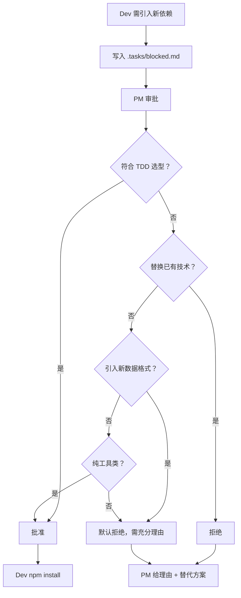
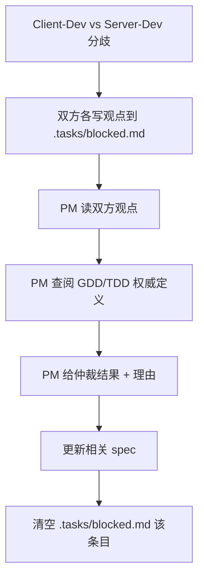

# 三 Agent 工作流配置

> 明暗斗地主项目 — PM Agent / Server-Dev Agent / Client-Dev Agent 协作规范

---

## 一、Agent 职责矩阵

| Agent | 身份 | 工作目录 | 修改权限 | 不可触碰 |
|-------|------|---------|---------|---------|
| **PM Agent** | 策划/项目管理 | `game_project/`（根目录）| `.tasks/` `specs/` `docs/` | `server/` `client/` `shared/` 代码 |
| **Server-Dev** | 服务端开发 | `game_project/server/` | `server/` `shared/` `infra/` | `client/` 任何文件 |
| **Client-Dev** | 客户端开发 | `game_project/client/` | `client/` | `server/` `infra/` `shared/`（只读） |

---

## 二、三 Agent Skills 配置

### 🎯 PM Agent — 策划/需求管理工具箱

**Skills 仓库路径**: `~/Product-Manager-Skills/skills/`

#### 日常高频（每周 3-5 次）

| Skill | 用途 | 触发场景 |
|-------|------|---------|
| `epic-hypothesis` | Epic 假设 + AC | Cris 提新功能 → 写 spec |
| `user-story` | Mike Cohn 用户故事 + Gherkin AC | Epic 拆单个故事 |
| `prioritization-advisor` | RICE/ICE/MoSCoW 排序 | backlog 超 10 条时决策优先级 |

#### 规划用（每月 1-2 次）

| Skill | 用途 | 触发场景 |
|-------|------|---------|
| `roadmap-planning` | 季度/里程碑路线图 | 规划 P5/P6 阶段 |
| `product-strategy-session` | 版本策略/上线后规划 | 大方向调整（如付费系统） |
| `epic-breakdown-advisor` | 大 feature 拆可并行 task | 复杂功能分解（如社交系统） |
| `prd-development` | 完整 PRD | 重大功能（跨 2+ sprint） |

#### 问题诊断用（按需）

| Skill | 用途 | 触发场景 |
|-------|------|---------|
| `problem-statement` | 模糊痛点 → 结构化问题 | 玩家反馈不清晰时 |
| `discovery-process` | 完整发现流程（问题→访谈→实验）| 新玩法验证 |
| `proto-persona` | 目标玩家画像 | 用户研究 |
| `customer-journey-map` | 玩家端到端体验流程 | 体验优化 |
| `user-story-mapping` | 按玩家旅程组织 backlog 全景 | 版本规划 |

#### 设计对齐用（按需）

| Skill | 用途 | 触发场景 |
|-------|------|---------|
| `lean-ux-canvas` | UI 改动前假设/用户/收益 | UI 重构前验证 |
| `recommendation-canvas` | 多方案结构化对比 | A/B/C 方案拍板 |
| `jobs-to-be-done` | JTBD 分析 | 理解玩家动机 |
| `opportunity-solution-tree` | 机会树（目标→机会→方案）| 战略分解 |

**已排除**（不适用游戏项目）:  
`saas-*` / `finance-*` / `positioning-*` / `tam-sam-som` / `pestel-analysis` / `press-release` / `*-readiness` / `pol-probe*`

---

### ⚙️ Server-Dev Agent — 服务端开发工具箱

**Skills 仓库路径**: `~/.agents/skills/tdd-guide/` + `~/.claude/plugins/cache/local/great_cto/`

#### TDD 核心流程（tdd-guide skill）

**来源**: alirezarezvani/claude-skills  
**核心能力**:
1. ✅ 从需求生成测试 — spec AC → 失败测试骨架（happy path + error + edge cases）
2. ✅ 识别边界遗漏 — 覆盖率报告 → P0/P1/P2 优先级缺口
3. ✅ 引导 TDD 循环 — RED（失败）→ GREEN（通过）→ REFACTOR（简化）

| 动作 | 工具 | 用途 | 触发时机 |
|------|-----|------|---------|
| **生成测试** | `test_generator.py` | 从 spec AC 生成失败测试骨架 | 认领任务，读完 spec 后 |
| **覆盖分析** | `coverage_analyzer.py` | 解析 lcov 报告，P0/P1/P2 排序缺口 | `npx jest --coverage` 后 |
| **TDD 循环** | `tdd_workflow.py` | RED→GREEN→REFACTOR 验证引导 | 写引擎逻辑时 |

**快速调用**:
```bash
# 生成测试（通过 Skill 工具）
Skill("tdd-guide", args="Generate tests from specs/<feature>.md, framework=Jest")

# 覆盖分析
npx jest --coverage
cd ~/.agents/skills/tdd-guide
python scripts/coverage_analyzer.py \
  --report ~/Desktop/game_project/server/coverage/lcov.info \
  --threshold 100 --priority P0

# TDD 循环验证
python scripts/tdd_workflow.py --phase red --test src/__tests__/<test>.test.ts
```

**覆盖硬要求**: `CardPatternEngine` + `RuleEngine` + `CodeCard` 100%

> 📘 **详细用法**见 `WORKFLOW-TDD.md` 完整文档

#### Karpathy Skills（必须加载）

| Skill | 用途 | 触发时机 |
|-------|------|---------|
| `/karpathy` | 代码简化检查（对齐 Karpathy Rules #1-4）| 实现完成后，commit 前 |
| `/simplify` | 识别过度抽象/未用代码 | 重构前 |
| `/verify` | 对照 spec AC 逐条验证 | 移入 `.tasks/done.md` 前 |

#### great_cto Agents（按需调用）

| Agent | 用途 | 触发时机 |
|-------|------|---------|
| `architect` | 架构决策 + ADR | 新 feature / 架构变更 |
| `senior-dev` | TDD 实现（对齐 Karpathy #1-4）| 从 `.tasks/backlog.md` 认领任务 |
| `qa-engineer` | 生成测试用例 + QA 报告 | 实现完成后 |
| `project-auditor` | 全项目代码健康审查 | 每 sprint 或技术债检查 |

**标准流水线**:  
```
architect → senior-dev → qa-engineer → project-auditor（定期）
   ↓            ↓             ↓
 ADR/doc     TDD实现      QA报告+bug
```

---

### 🎮 Client-Dev Agent — 客户端开发工具箱

**Skills 仓库路径**: `~/.agents/skills/tdd-guide/` + `~/.claude/plugins/cache/local/great_cto/`

#### TDD 核心流程（tdd-guide skill）

**来源**: alirezarezvani/claude-skills  
**核心能力**: 同 Server-Dev（生成测试 / 覆盖分析 / TDD 循环）

| 动作 | 工具 | 用途 | 触发时机 |
|------|-----|------|---------|
| **生成测试** | `test_generator.py` | 从 spec AC 生成 Logic 层测试 | 认领任务，读完 spec 后 |
| **覆盖分析** | `coverage_analyzer.py` | 解析 lcov 报告，P0/P1/P2 排序缺口 | `npx jest --coverage` 后 |
| **TDD 循环** | `tdd_workflow.py` | RED→GREEN→REFACTOR 验证引导 | 写 Logic 层纯业务逻辑时 |

**快速调用**:
```bash
# 生成测试（通过 Skill 工具）
Skill("tdd-guide", args="Generate tests from specs/<feature>.md, framework=Jest, layer=logic")

# 覆盖分析
npx jest --coverage
cd ~/.agents/skills/tdd-guide
python scripts/coverage_analyzer.py \
  --report ~/Desktop/game_project/client/coverage/lcov.info \
  --threshold 80 --priority P0

# 架构红线检查（每次 commit 前必跑）
grep -r "from 'cc'" assets/scripts/logic/  # 必须无输出
```

**覆盖硬要求**: `GameMgr` + `*Logic.ts`（Logic 层所有业务逻辑）

> 📘 **详细用法**见 `WORKFLOW-TDD.md` 完整文档

#### Karpathy Skills（必须加载）

| Skill | 用途 | 触发时机 |
|-------|------|---------|
| `/karpathy` | 代码简化检查（对齐 Karpathy Rules #1-4）| 实现完成后，commit 前 |
| `/simplify` | 识别过度抽象/未用代码 | 重构前 |
| `/verify` | 对照 spec AC 逐条验证 | 移入 `.tasks/done.md` 前 |

#### 架构红线检查（每次 commit 前必跑）

```bash
# 输出必须为空，否则不得提交
grep -r "from 'cc'" client/assets/scripts/logic/   # Logic 层禁止 import 'cc'
grep -r "oops\.gui\.open\|oops\.gui\.remove" client/assets/scripts/ui/view/  # 弹层必须走 LayerManager
```

#### great_cto Agents（按需调用）

| Agent | 用途 | 触发时机 |
|-------|------|---------|
| `architect` | UI flow 架构决策 + ADR | 新 UI 模块 / 架构层变更 |
| `senior-dev` | TDD 实现（对齐 Karpathy #1-4）| 从 `.tasks/backlog.md` 认领 `[client]` 任务 |
| `qa-engineer` | 生成测试用例 + QA 报告 | 实现完成后 |
| `project-auditor` | 全项目分层合规检查（Ctrl/GameMgr/Logic）| 每 sprint 或架构红线检查 |

**标准流水线**:  
```
architect → senior-dev → qa-engineer → project-auditor（定期）
   ↓            ↓             ↓
 ADR/doc     TDD实现      QA报告+bug
```

---

## 三、协作工作流

### 3.1 标准任务流（单端任务）

```mermaid
graph TD
    A[Cris 提需求] --> B[PM: 写 spec]
    B --> C[PM: 加入 .tasks/backlog.md]
    C --> D{哪个端？}
    D -->|server| E[Server-Dev 认领]
    D -->|client| F[Client-Dev 认领]
    E --> G[/tdd-gen 生成测试]
    F --> G
    G --> H[RED: 实现代码]
    H --> I[GREEN: 测试通过]
    I --> J[/karpathy 简化检查]
    J --> K[/verify 对照 AC]
    K --> L[更新 .tasks/done.md]
    L --> M[PM 验收]
```

**关键节点**：
1. **认领时**：立即更新 `.tasks/in-progress.md`（未更新 = 未认领）
2. **完成时**：立即更新 `.tasks/done.md` + 从 `in-progress.md` 删除
3. **阻塞时**：写入 `.tasks/blocked.md` → PM 决策

---

### 3.2 shared/ 变更流（跨端协调）



**红线**：
- Client-Dev **只读** `shared/`，禁止直接修改
- Server-Dev 改 `shared/` 前必须经 PM 批准
- PM 负责通知 Client-Dev 同步（在 `.tasks/blocked.md` 留同步通知）

---

### 3.3 新依赖审批流（技术债管控）



**PM 审批标准**（来自 TDD v1.0）：
1. TDD 第一章是否有对应选型？有 → 直接批准 ✅
2. 是否替换了已有技术？是 → 直接拒绝 ❌
3. 是否是纯工具类（类型定义、测试辅助）？是 → 可批准 ✅
4. 是否引入新的数据格式或通信协议？是 → 默认拒绝 ❌

---

### 3.4 冲突仲裁流（跨端分歧）



**常见冲突类型**：
- 协议字段命名分歧 → PM 查 PROTOCOL.md 权威定义
- 暗号牌规则理解不一致 → PM 查 GAME-RULES.md
- 性能优化方案选择 → PM 使用 `/pm-reco` 多方案对比

---

## 四、Agent 启动 Checklist

### PM Agent 启动清单

```bash
cd ~/Desktop/game_project
# 确认身份
cat CLAUDE.md | grep "我是 PM Agent"
# 确认 Skills 可用
ls ~/Product-Manager-Skills/skills/ | wc -l  # 应该 = 51
# 确认任务板状态
cat .tasks/blocked.md    # 无阻塞项
cat .tasks/in-progress.md  # 确认进行中任务
```

---

### Server-Dev Agent 启动清单

```bash
cd ~/Desktop/game_project/server
# 确认身份
cat CLAUDE.md | grep "我是 Server-Dev Agent"
# 确认测试环境
npx jest --no-coverage 2>&1 | tail -5  # 应显示 "Tests: XXX passed"
# 确认 TDD Skill
ls ~/.agents/skills/tdd-guide/SKILL.md
# 确认数据库/Redis（如需启动服务端）
docker ps | grep mysql
docker ps | grep redis
```

**启动服务端**（如需联调）：
```bash
AI_FILL_DELAY=0 npx ts-node --project tsconfig.json src/index.ts
# 监听 ws://localhost:2567
```

---

### Client-Dev Agent 启动清单

```bash
cd ~/Desktop/game_project/client
# 确认身份
cat CLAUDE.md | grep "我是 Client-Dev Agent"
# 确认测试环境
npx jest --no-coverage 2>&1 | tail -5  # 应显示 "Tests: XXX passed"
# 架构红线检查
grep -r "from 'cc'" assets/scripts/logic/  # 应无输出
# 确认 TDD Skill
ls ~/.agents/skills/tdd-guide/SKILL.md
```

**Cocos Creator**（如需预览）：
打开 Cocos Dashboard → 打开项目 → Editor → 预览（LaunchScene）

---

## 五、典型场景剧本

### 场景 1：新功能开发（单端）

**示例**：TASK-050s 动画同步修复（服务端）

1. **PM**: 使用 `/spec` 生成 `specs/animation-sync.md`
2. **PM**: 在 `.tasks/backlog.md` 新增条目
3. **Server-Dev**: 认领任务，更新 `.tasks/in-progress.md`
4. **Server-Dev**: 读 `specs/animation-sync.md` 全部 AC
5. **Server-Dev**: 使用 tdd-guide 生成失败测试
   ```bash
   Skill("tdd-guide", args="Generate tests from specs/animation-sync.md AC-S1~S8, framework=Jest")
   ```
6. **Server-Dev**: 验证测试失败（RED）
   ```bash
   npx jest --no-coverage CardRoom.050s.test.ts
   # 预期: 0 passed, 8 failed
   ```
7. **Server-Dev**: 实现代码让测试通过（GREEN）
   ```bash
   # 逐条实现 AC-S1~S8
   npx jest --no-coverage CardRoom.050s.test.ts
   # 预期: 8 passed, 0 failed
   ```
8. **Server-Dev**: 覆盖率分析，找遗漏边界
   ```bash
   npx jest --coverage
   cd ~/.agents/skills/tdd-guide
   python scripts/coverage_analyzer.py \
     --report ~/Desktop/game_project/server/coverage/lcov.info \
     --threshold 100 --priority P0
   # 补充 P0 缺口测试
   ```
9. **Server-Dev**: `/karpathy` 简化检查
10. **Server-Dev**: `/verify` 对照 AC
11. **Server-Dev**: 更新 `.tasks/done.md`
12. **PM**: 验收，移入 `Done` 归档

> 📘 **完整 TDD 流程示例**见 `WORKFLOW-TDD.md` 第五章

---

### 场景 2：shared/ 变更（单一数据源）

**现状**: TASK-051 消除代码重复后，client 直接引用 `/shared/`，无需同步。

**流程**:
1. **Server-Dev**: 需改 `shared/PatternHelper.ts`
2. **Server-Dev**: 直接改动 + 补测试（无需 blocked.md 报告）
3. **Server-Dev**: 更新 `.tasks/done.md`
4. **Client-Dev**: 无需操作（自动生效）

**验证**: 双端测试全绿即可（server 407/407, client 145/145）

---

### 场景 3：技术选型审批

**示例**：Client-Dev 想引入 `lottie-web` 做动画

1. **Client-Dev**: 写入 `.tasks/blocked.md`  
   ```
   - [ ] NEW-DEP 引入 lottie-web：用于结算界面身份揭晓动画 | 需要: PM 技术选型审批 | 报告人: client-dev
   ```
2. **PM**: 读阻塞条目，查阅 TDD v1.0 第一章
3. **PM**: 发现 TDD 未列 lottie-web，且引入新数据格式（JSON 动画）
4. **PM**: 使用 `/pm-reco` 多方案对比  
   - 方案 A: Cocos 原生 Animation 组件
   - 方案 B: Spine 动画（已有技术）
   - 方案 C: lottie-web（新依赖）
5. **PM**: 拒绝，回复理由  
   ```
   [x] NEW-DEP lottie-web 拒绝 | 理由: TDD 第一章未列 + 引入新数据格式 + Cocos Animation 足够 | 替代方案: 用 Cocos tween + Animation 组件 | 日期: 2026-07-09
   ```
6. **Client-Dev**: 采用 PM 推荐的替代方案

---

### 场景 4：紧急 Bug 修复

**示例**：ISSUE-S007 realPlayerCount=0 时 503 崩溃

1. **Server-Dev**: 发现 Bug，写入 `.tasks/blocked.md`（如需 PM 决策是否打断当前任务）
2. **PM**: 评估优先级，决定立即修复
3. **Server-Dev**: 暂停当前任务（`.tasks/in-progress.md` 保留），认领 Bug
4. **Server-Dev**: 写失败测试复现 Bug
5. **Server-Dev**: 修复，测试通过（398/398）
6. **Server-Dev**: `/verify` 确认修复
7. **Server-Dev**: 更新 `.tasks/done.md`
8. **Server-Dev**: 继续暂停的任务

---

## 六、Skills 快速索引

### PM Agent 快查表

```bash
# 日常
/spec                # 新 feature → Epic 假设 + AC
/pm-story            # Epic → 单个用户故事
/pm-prioritize       # backlog 排序

# 规划
/pm-roadmap          # 季度路线图
/pm-strategy         # 版本策略
/pm-epic             # 大 feature 拆分
/pm-prd              # 完整 PRD

# 诊断
/pm-problem          # 模糊痛点 → 结构化问题
/pm-discover         # 完整发现流程
/pm-persona          # 玩家画像
/pm-journey          # 玩家旅程图

# 设计
/pm-canvas           # Lean UX 一页纸
/pm-reco             # 多方案对比决策
```

---

### Server-Dev / Client-Dev 快查表

```bash
# TDD 核心（tdd-guide skill）
Skill("tdd-guide", args="Generate tests from specs/<feature>.md, framework=Jest")
# 覆盖分析
npx jest --coverage
cd ~/.agents/skills/tdd-guide
python scripts/coverage_analyzer.py \
  --report <project>/coverage/lcov.info \
  --threshold 100 --priority P0
# TDD 循环验证
python scripts/tdd_workflow.py \
  --phase red \
  --test src/__tests__/<test>.test.ts

# Karpathy 检查
/karpathy            # 代码简化检查
/simplify            # 识别过度抽象
/verify              # 对照 spec AC 验证

# great_cto Agents
/architect           # 架构决策 + ADR
/audit               # 全项目代码健康审查
```

> 📘 **tdd-guide 详细用法**见 `WORKFLOW-TDD.md`

---

## 七、红线总结（不可违反）

| 红线 | Agent | 检查方式 |
|------|-------|---------|
| **任务认领必更新** `.tasks/in-progress.md` | All | PM 检查，未更新 = 未认领 |
| **任务完成必更新** `.tasks/done.md` | All | PM 检查，未更新 = 未完成 |
| **shared/ 变更必审批** | Server-Dev | PM 在 `.tasks/blocked.md` 批准 |
| **新依赖必审批** | Server-Dev, Client-Dev | PM 审批，符合 TDD 选型 |
| **Client-Dev 不改 shared/** | Client-Dev | PM 检查 git diff |
| **Logic 层禁 import 'cc'** | Client-Dev | `grep -r "from 'cc'" client/assets/scripts/logic/` |
| **Server 注释红线** | Server-Dev | 每个 .ts 必须有文件头 + public 方法 JSDoc |
| **Client 注释红线** | Client-Dev | 每个 .ts 必须有文件头 + public 方法 JSDoc + @layer 标记 |

---

## 八、下一步行动

**立即可做**：

1. **PM**: 认领 TASK-050s/c（动画同步修复），使用 `/spec` 完善 spec
2. **Client-Dev**: 在 Cocos Editor 完成 TASK-045b（SettlementView Prefab 补全）
3. **PM**: 规划 P5.3 路线图，使用 `/pm-roadmap`

**本周目标**：
- 完成 TASK-045b + TASK-050s/c → P5.2 阶段收尾
- PM 产出 P5.3 roadmap（大厅功能增强 + 音效系统）

---

## 附录：Skills 完整列表

### PM Skills（51 个，已排除不适用）

**✅ 适用**（22 个）:  
`epic-hypothesis` `user-story` `prioritization-advisor` `roadmap-planning` `product-strategy-session` `epic-breakdown-advisor` `prd-development` `problem-statement` `discovery-process` `proto-persona` `customer-journey-map` `user-story-mapping` `lean-ux-canvas` `recommendation-canvas` `jobs-to-be-done` `opportunity-solution-tree` `user-story-splitting` `storyboard` `problem-framing-canvas` `product-sense-interview-answer` `discovery-interview-prep` `customer-journey-mapping-workshop`

**❌ 已排除**（29 个）:  
`saas-*`（3个）`finance-*`（2个）`positioning-*`（2个）`tam-sam-som-calculator` `pestel-analysis` `press-release` `company-research` `eol-message` `executive-onboarding-playbook` `*-readiness-advisor`（4个）`pol-probe*`（2个）`context-engineering-advisor` `ai-shaped-readiness-advisor` `acquisition-channel-advisor` `business-health-diagnostic` `organic-growth-advisor` `feature-investment-advisor` `altitude-horizon-framework` `pm-skill-creator` `skill-authoring-workflow` `workshop-facilitation` `user-story-mapping-workshop`

### Dev Skills（6 个）

**TDD Guide**（3 个）:  
`/tdd-gen` `/tdd-coverage` `/tdd-cycle`

**Karpathy Skills**（3 个）:  
`/karpathy` `/simplify` `/verify`

**great_cto Agents**（4 个）:  
`architect` `senior-dev` `qa-engineer` `project-auditor`

---

**版本**: v1.0  
**更新**: 2026-07-09  
**维护**: PM Agent